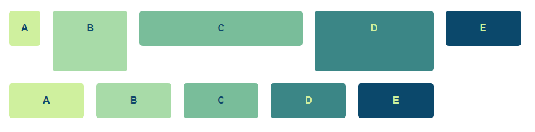
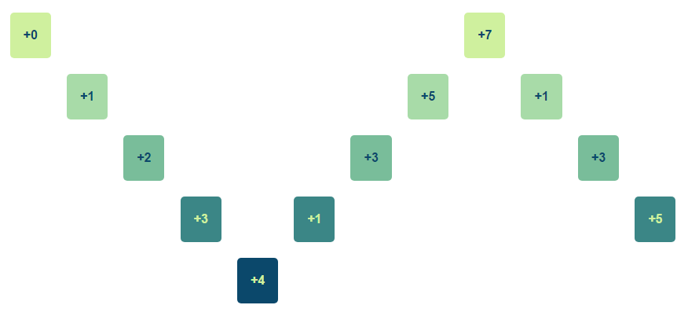
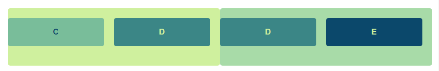
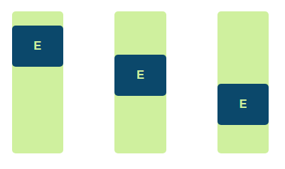

## CSS Usage

Any element can become part of the grid system by adding the `.gl-grid` class. Items within the grid are sized with `.gl-grid__item--{number}` where `{number}` is a 1-12 value indicating the number of columns.

margins, gutters and number of columns are parameterizable (by changing the `:root` variables on `flex.css`). To change the `max-width` you'll also need to update the media queries.

Elements flow horizontally and are sized to the minimum height of the row.



Elements are positioned automatically but if there needs to be space between elements you can add an offset between them. To do that add the class `.gl-grid__item--offset-{number}` where `{number}` indicates the number of columns to offset the element.



Elements can be nested and respect the layout of the parent column if they don't change the size of their box. For instance a subgrid within an element of size 6 would be defined as follows:

```html
<div class="gl-grid">
  <!-- ... -->
  <div class="gl-grid gl-grid__item-6">
    <div class="gl-grid__item-3">C</div>
    <div class="gl-grid__item-3">D</div>
  </div>
</div>
```

And would look like:



An alternative, fraction-based layout is also available. For instance, if we wanted to distribute 2 elements evenly (regardless of their column size), we could do:

```html
<div class="gl-grid">
  <div class="gl-grid__item-1fr">C</div>
  <div class="gl-grid__item-1fr">D</div>
</div>
```

The `fr` in the class name indicates it's fraction-based and the number indicates the number of fractions. Elements don't have to be evenly distributed, for instance, if the first element takes 3 / 4 of the total space and the second one 1 / 4, we would define them as:

```html
<div class="gl-grid">
  <div class="gl-grid__item-3">C</div>
  <div class="gl-grid__item-1">D</div>
</div>
```

Vertical alignment defaults to the top but can be changed to middle by adding `.gl-grid--middle` to the parent container or to the bottom with `.gl-grid--bottom`.



Horizontal alignment you can add the `.gl-grid--center` or `.gl-grid--right` classes:

```html
  <div class="gl-grid box1 gl-grid--center">
    <div class="gl-grid__item--2">D</div>
    <div class="gl-grid__item--2">E</div>
  </div>
  <div class="gl-grid box1 gl-grid--right">
    <div class="gl-grid__item--2">D</div>
    <div class="gl-grid__item--2">E</div>
  </div>
```


The grid shrinks when the browser window is smaller than 1280px and locks at that position. To keep the grid centered for these bigger screen sizes you'll need: `.gl-grid-root` and `.gl-grid-content`:

```html
  <div class="gl-grid-root">
    <div class="gl-grid-content">
      <!-- all grids and subgrids go here -->
    </div>
  </div>
```

`.gl-grid-root` defines the full-width container in which `.gl-grid-content` will fit. This results in a page layout limited to 1280px centered.

If you want an element to stretch to the size of its row / column you need to add the `.gl-grid__item--stretch` class:

```html
<body class="gl-grid gl-grid--vertical">
  <header class="gl-grid-root">
    <div class="gl-grid-content">
      <div class="gl-grid gl-grid__item--12 gl-grid--center">Centered Title</div>
    </div>
  </header>
  <main class="gl-grid-root gl-grid__item--stretch">
    <div class="gl-grid-content">
      <div class="gl-grid gl-grid__item--12">Content goes here</div>
    </div>
  </main>
  <footer class="gl-grid-root">
    <div class="gl-grid-content">
      <div class="gl-grid gl-grid__item--12 gl-grid--center">Centered Footer</div>
    </div>
  </footer>
</body>
```
